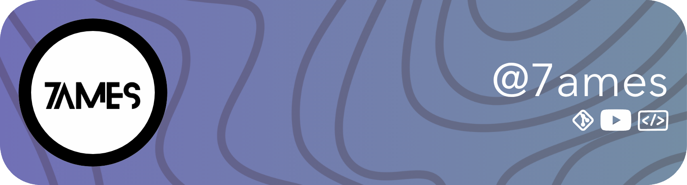

---

Welcome to my GitHub profile! I'm a passionate coder and technology
enthusiast. Here you'll find a collection of my projects, my skills,
and more.

## Skills

### Programming Languages

### Tools & Platforms

## Projects

Here are some of my favourite projects:

- [kebab-tools](https://github.com/kebab-os/kebab-tools): A robust, endpoint-based, command-line set of developer utilities built for developers
- [kebab-gui](https://github.com/kebab-os/kebab-gui): High-performance, window-based operating system environment
- [Arc](https://github.com/arc-assistant): Lightweight, open-source smart assistant
- [Turtle String](https://github.com/7aimez/turtle_string): Lightweight library of letters in python turtle
- [Nenode AI](https://github.com/nenode/nenode): Basic intent based AI writting in JS and using brain.js
- [Team Bob (cvc-ftc) Website](https://github.com/cvc-ftc/cvc-ftc.github.io): Website for the Team Bob (CVC-FTC) robotics team

[View more](projects.md)

## YouTube Channel

I also like to make music. Check out [my YouTube channel](https://youtube.com/@7ames-music), and subscribe!

## GitHub Stats

**Thanks for visiting my profile!** 

  

<a href="#top">

  
  
  
  

